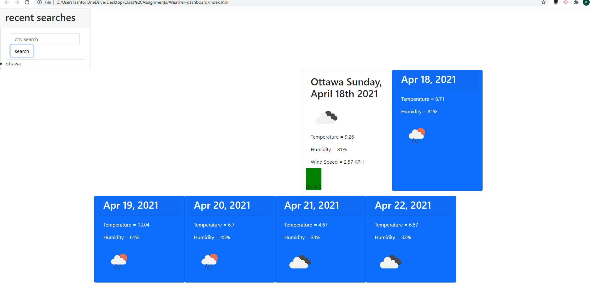

# Weather Dashboard

  
[](https://opensource.org/licenses/mit)
  
## Description
An App that shows the weather and long range forcast of a choosen city
  
## Table of Contents
- [Installation](#installation)
- [Usage](#usage)
- [Screenshot](#screenshot)
- [License](#license)
- [Questions](#questions)
  

  
## Usage
```md
clone the repository and open index folder in your browser or follow the link https://ashiemotto.github.io/Weather-dashboard/
```
  
## Screenshot
#
  
## Reporting
```md
GitHub
```
## License
[](https://opensource.org/licenses/mit)
  
## Questions a
Add an issue through GitHub:
 https://github.com/Ashiemotto
  
Or using email:
Email: Ashheadley@gmail.com

